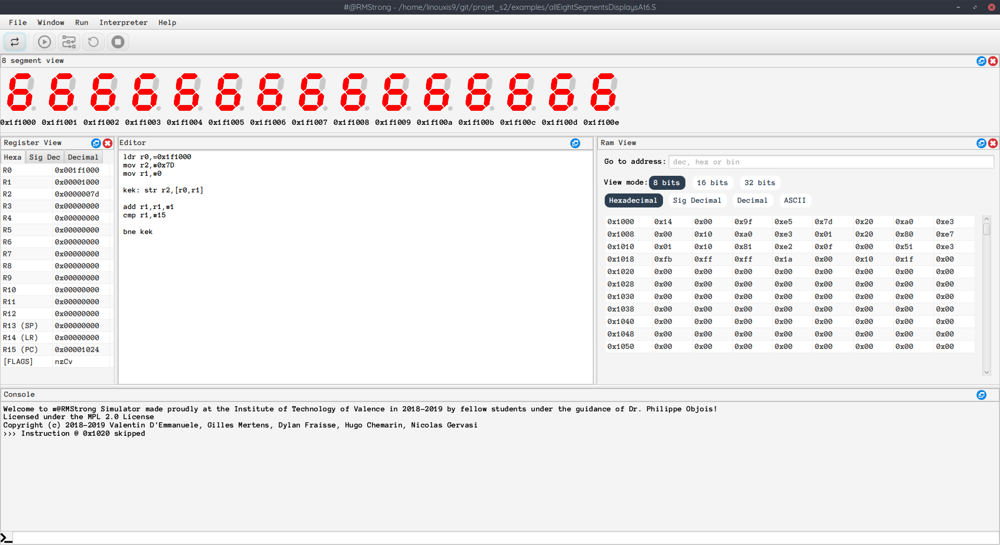
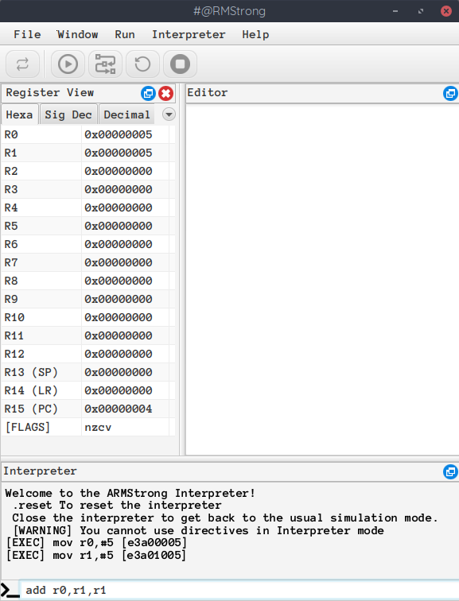
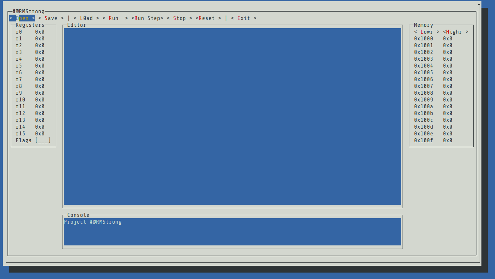
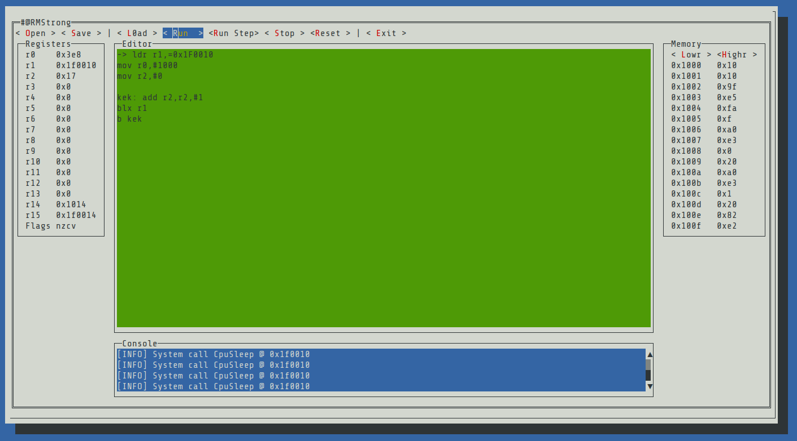
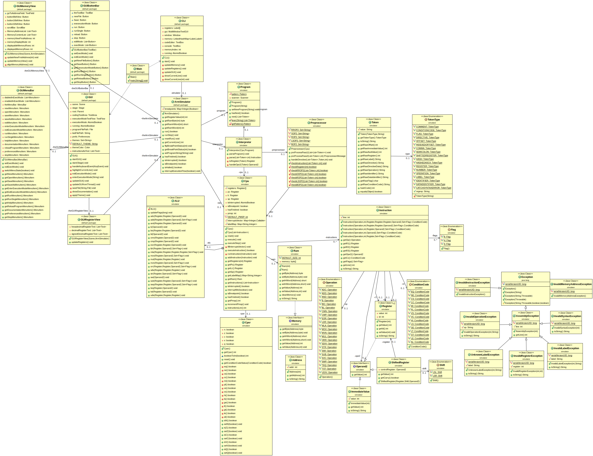

# 

## A fast and simple ARM Simulator made for education

[The Javadoc is available here](http://projectarm.devling.net/api/)

```java
public class HelloWorld {

    public static void main(String[] args) {
        System.out.println("Bienvenue sur le dépot du Projet S2 2017-2018 #@rmsim de l'IUT de Valence!");
    }

}
```

> We now have split our project into 3 branches...
>
> * master is the branch containing the latest work around the simulator backend / library.
> * theGUI is the branch containing the latest work regarding the Graphical User Interface in JavaFX.
> * cli is the branch containing the latest work regarding the Command Line Interface.
>
> These last two branches pulls from master from time to time to keep their backend in sync.

> Screenshots:

> 
> 
> 
> 


***

## Petite explication

> 


Le Main s'occupe de créer l'instance (singleton) d'ArmSimulator.

ArmSimulator s'occupe ainsi de créer une instance de CPU, Program, IHMEditor, IHMSimulator et Interpretor qui prends en paramètre l'instance de Program et de CPU nouvellement crées.

---
Interpretor implémente Iterator<Instruction>, c'est à dire qu'il peut itérer sur les lignes (String) d'assembleur du Program.
Pour chaque ligne de code dans Program, l'Interpretor crée un objet de classe Instruction qui correspond.

Exemple : new Instruction(Operation.MOV,cpu.myRegisters[0],new ImmediateValue(2),new Flags(),ConditionCode.AL);
      Instruction(Operation,Register,Operand2,Flags,ConditionCode)
Infomations:
- Il y a plusieurs constructeurs pour Instruction selon le nombre de Registre requis pour l'OP.
- Les Flags c'est par exemple S pour signed ou pour mettre à jour les Codes conditions, ou B dans ldrb pour récupèrer un seul byte au lieu d'un mot de 32bits.
- ConditionCode EQ, NE, AL etc etc...
Interpretor ajoute cette instruction dans la mémoire du Processeur avec la méthode cpu.addInstruction(instruction).
---

Une fois cela terminé, l'objet ArmSimulator peut soit :
- Exécuter pas à pas les instructions du processeur en utilisant la méthode cpu.executeStep() qui exécute l'instruction pointé par le registre PC c'est à dire this.myInstructions.get(this.pc.get());
- Soit exécuter toutes les intructions restantes à exécuter en utilisant la méthode cpu.execute() qui exécute jusqu'à la dernière instruction de la liste.
Dans chaque cas, le registre PC est incrémenté entre l'exécution de chaque instruction.

---

La méthode cpu.executeStep() passe les informations de l'instruction à la bonne méthode de l'ALU uniquement si le ConditionCode est respecté sinon l'instruction est ignoré. Pour cela, il vérifie le statut du Cspr appartenant au CPU. La classe Cspr contient une méthode qui pour un ConditionCode donnée, retourne le résultat de celui-ci en fonction des flags NZCV.
Une instruction prends généralement un ou plusieurs registre ainsi qu'une Operand2.

---

Operand2 est implémentée par Register, ShiftedRegister, ImmediateValue, Pointer

- Une instruction utilisant un Register comme Operand2, récupérera simplement la valeur de celui-ci.
- Une instruction utilisant un ShiftedRegister utilisera la valeur d'un Register comme spécifié à l'aide de l'enum Shift et de la valeur du shift dans un autre Operand2.
- Une instruction utilisant un Pointer comme Operand2 récupérera simplement la valeur à l'adresse pointé par le pointeur.
- Une instruction utilisant une ImmediateValue utilisera simplement la valeur de celle-ci.

> Made with :heart: by the #@rmsim Team